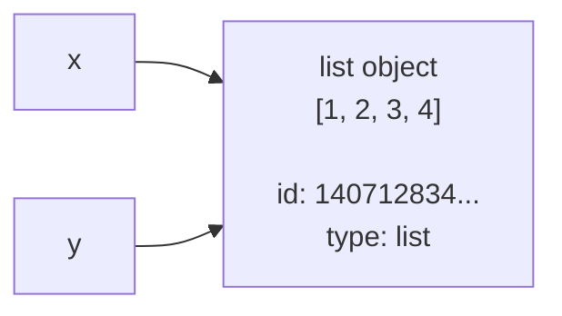
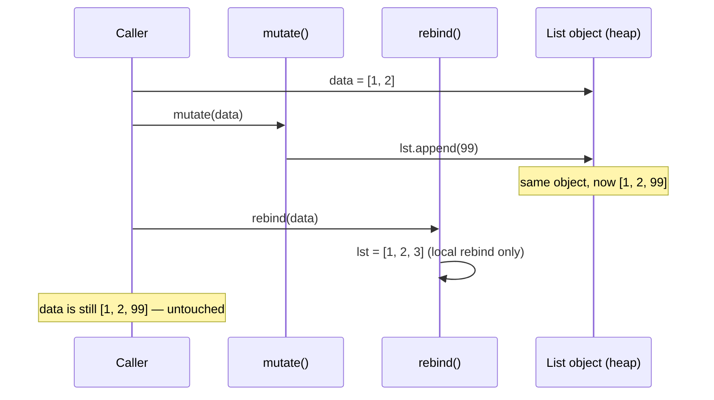

Module 1 · Python Internals · Topic 1/20

## The one idea to hold onto

Here's the thing that unlocks basically everything else in this module: **everything in Python is an object** — numbers, strings, functions, classes, modules, even `None`. And every object, no matter what it is, always carries exactly three things:

| Property | What it means | How you check it |
|---|---|---|
| **Identity** | A unique ID for the object's lifetime — think of it as its memory address in CPython | `id(obj)` |
| **Type** | What kind of object it is, and what it can do | `type(obj)` |
| **Value** | The data it holds — which may or may not be changeable | `obj` itself |

The part that trips people up: **a variable name is not a box that holds a value** — it's a **label (reference) pointing at an object**. Once that clicks, most of Python's "weird" behavior around copying, function arguments, and mutability stops being weird.

```python
x = [1, 2, 3]
y = x        # y is NOT a copy — it's another label on the SAME object
y.append(4)
print(x)     # [1, 2, 3, 4]  <- x changed too!
```

Here's what's actually happening in memory when that runs:



`x` and `y` are two different labels pointing at **one** object. Mutating through `y` is visible through `x`, because there was only ever one list — nothing got copied.

:::note
This is the single most useful mental model in this whole module. Every time something in Python surprises you later, come back to "names are labels, not boxes" first.
:::

## `id()` — object identity

- Returns an integer that is **guaranteed unique and constant for the object's lifetime**.
- In **CPython** (the implementation you're almost certainly using), `id()` happens to return the object's **memory address**. That's an implementation detail, not a language guarantee — don't rely on the *value* itself, only on the fact that it's unique-per-object.
- Once an object is garbage collected, its `id` can be **reused** by a new object. So `id()` only tells you something meaningful about objects that are alive *at the same time*.

```python
a = "hello"
b = "hello"
print(id(a), id(b))   # often the SAME id (see interning below)
print(a is b)         # True (usually, for short strings)
```

### `is` vs `==`

This trips up almost everyone at least once.

| Operator | Compares | Question it answers |
|---|---|---|
| `is` | Identity (`id(a) == id(b)`) | "Are these literally the same object?" |
| `==` | Value (calls `__eq__`) | "Do these have equal value?" |

```python
a = [1, 2, 3]
b = [1, 2, 3]

a == b   # True  -> same contents
a is b   # False -> two distinct list objects in memory
a is a   # True  -> obviously, same object
```

:::tip[Rule of thumb]
Use `is` only for singletons — `None`, `True`, `False`, and (carefully) `Enum` members. Everywhere else, use `==`.
:::

```python
if x is None:      # idiomatic, fast, correct
    ...
if x == None:       # works but not idiomatic, can be fooled by __eq__ overrides
    ...
```

## `type()` — what kind of object

- `type(obj)` returns the **class** of the object — and in Python, classes are objects too.
- `type(obj) is SomeClass` checks the *exact* type (no subclasses allowed).
- `isinstance(obj, SomeClass)` checks the type *or any subclass* — almost always what you actually want.

```python
class Animal: pass
class Dog(Animal): pass

d = Dog()
type(d) is Dog          # True
type(d) is Animal       # False  <- exact match only
isinstance(d, Animal)   # True   <- respects inheritance
```

Because classes are themselves objects, `type()` of a class gives you its **metaclass** (more on this in Topic 14 — Metaclasses):

```python
type(Dog)     # <class 'type'>
type(type)    # <class 'type'>  <- type is its own metaclass, turtles stop here
```

## Mutability — the property that causes 90% of the confusion

An object is either:

- **Mutable** — its internal state can change *without* changing its identity (`id` stays the same).
- **Immutable** — once created, its value can never change. "Modifying" it actually creates a brand-new object.

| Immutable | Mutable |
|---|---|
| `int`, `float`, `complex`, `bool` | `list` |
| `str` | `dict` |
| `tuple`* | `set` |
| `frozenset` | `bytearray` |
| `bytes` | custom classes (by default) |
| `range` | |

<small>*A tuple is immutable as a *container* (you can't reassign its slots), but if it holds a mutable object, that inner object can still change: `t = ([1,2], 3); t[0].append(4)` works fine — `t` itself never changed identity.</small>

```python
# Immutable: "changing" a string makes a NEW object
s = "hello"
print(id(s))
s += " world"
print(id(s))   # different id — this is a brand new string object

# Mutable: changing a list keeps the SAME object
lst = [1, 2]
print(id(lst))
lst.append(3)
print(id(lst))  # same id — modified in place
```

### Why this matters: the classic mutable-default-argument trap

Almost everyone gets bitten by this one eventually:

```python
def add_item(item, bucket=[]):   # danger: default created ONCE at def time
    bucket.append(item)
    return bucket

add_item("a")   # ['a']
add_item("b")   # ['a', 'b']  <- surprise! same list reused across calls
```

`bucket=[]` is evaluated **once**, when the function is defined — not on every call. Since lists are mutable, every call that doesn't pass `bucket` explicitly shares the *same* object.

:::caution[Fix]
```python
def add_item(item, bucket=None):
    if bucket is None:
        bucket = []
    bucket.append(item)
    return bucket
```
:::

## How this shapes function calls: "pass by object reference"

Python is neither strictly "pass by value" nor "pass by reference" — it's often described as **"pass by object reference"** (or "call by sharing"). The function parameter becomes a new label pointing at the *same* object the caller passed in.

- If you **mutate** the object in place (`.append`, `[i]=`, `.update`) → the caller sees the change.
- If you **rebind** the parameter to a new object (`x = something_else`) → that only changes the local label; the caller's object is untouched.



```python
def mutate(lst):
    lst.append(99)          # mutates the SAME object -> visible outside

def rebind(lst):
    lst = [1, 2, 3]          # rebinds local name -> NOT visible outside

data = [1, 2]
mutate(data)
print(data)   # [1, 2, 99]

rebind(data)
print(data)   # [1, 2, 99]  <- unchanged, rebind didn't touch the original object
```

## Interning & small-object caching (a CPython optimization, not a language rule)

CPython pre-creates and reuses certain objects to save memory:

- **Small integers** `-5` to `256` are cached at startup — every reference to `100` anywhere in your program is literally the same object.
- **Some strings** — identifiers, string literals that look like valid variable names — get **interned**, so equal strings can share one object.

```python
a = 100
b = 100
a is b            # True  -> small int cache

x = 100000
y = 100000
x is y            # False (often) -> outside the cached range, two separate objects

s1 = "hello"
s2 = "hello"
s1 is s2          # True -> interned literal

s3 = "".join(["h","e","l","l","o"])
s1 is s3          # False -> built at runtime, not interned automatically
```

:::caution
Never rely on this behavior in real code. It's a CPython implementation detail that can differ between versions and other interpreters (PyPy, Jython). Great interview trivia, terrible thing to depend on in production. Always compare values with `==`, not identity, unless you specifically mean "same object."
:::

## What an object actually looks like under the hood (CPython)

Every Python object in CPython starts with a small fixed header (simplified):

```c
typedef struct _object {
    Py_ssize_t ob_refcnt;   // reference count (Topic 2)
    PyTypeObject *ob_type;  // pointer to the type object
} PyObject;
```

- `ob_refcnt` → how many references point at this object right now. Drives reference counting (next topic).
- `ob_type` → what `type()` actually reads.

This is why `type()` and `id()` are cheap, constant-time operations — they're just reading fields off this header, not computing anything.

## Useful tools while studying this topic

```python
id(obj)                   # identity
type(obj)                  # type
obj.__class__               # usually same as type(obj)
sys.getrefcount(obj)        # how many references point at obj (Topic 2 preview)
sys.getsizeof(obj)          # size in bytes
obj.__hash__()               # only meaningful for hashable (usually immutable) objects
```

## Quick self-test

<details>
<summary><strong>Q1.</strong> What does this print?</summary>

```python
a = [1, 2]
b = a
a = a + [3]
print(b)
```

**Answer:** `[1, 2]`. `a + [3]` creates a **new** list and rebinds `a` to it. `b` still points at the original list, which was never mutated.

</details>

<details>
<summary><strong>Q2.</strong> Are these <code>True</code> or <code>False</code>?</summary>

```python
x = 256
y = 256
print(x is y)   # ?

x = 257
y = 257
print(x is y)   # ?
```

**Answer:** `True`, then usually `False`. `256` is inside CPython's cached small-int range (`-5` to `256`); `257` is not, so two separate objects are typically created (this can vary — never rely on it).

</details>

<details>
<summary><strong>Q3.</strong> Why is this function dangerous?</summary>

```python
def f(x, cache={}):
    cache[x] = x * x
    return cache
```

**Answer:** The default `{}` is created once at function-definition time and reused across every call that doesn't pass `cache` explicitly — it silently accumulates state between unrelated calls. Use `cache=None` and create the dict inside the function instead.

</details>

<details>
<summary><strong>Q4.</strong> True or false: tuples are always fully immutable.</summary>

**Answer:** False. A tuple's *slots* can't be reassigned, but if it contains a mutable object (like a list), that inner object can still be mutated. Immutability is about the container's identity/structure, not necessarily everything reachable from it.

</details>

## Key takeaways

1. Variables are **labels**, not boxes — assignment binds a name to an object, it doesn't copy.
2. `is` compares identity, `==` compares value — use `is` only for `None`/singletons.
3. Mutability is a property of the **object's type**, not the variable.
4. Function arguments are passed by object reference — mutate in place and callers see it; rebind and they don't.
5. Small-int caching and string interning are CPython optimizations — real, observable, but never something to depend on.

## Up next

**Topic 2: Reference Counting vs Garbage Collector** — now that you know every object has an `ob_refcnt`, the next question is: how does Python know when it's safe to free an object, and what happens when objects reference each other in a cycle?
